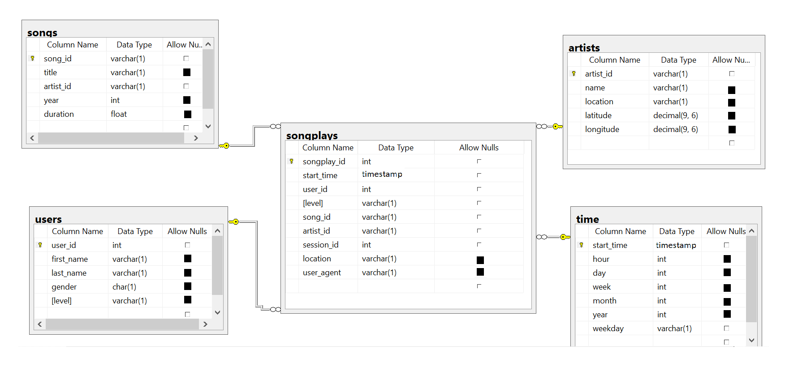

<h1>Introduction</h1>
Sparkify, music startup needs to analyze the data for the informed decisions which will directly help them to grow their business thourgh their user's trends.
Through this database we can add more value to the business of sparkify through user location, what type of artist user like whcih directly help sparkify to do personalized marketing and give user a personalized experience.

<h1>Database schema design</h1>
The purpose is to create dimensional model using star schema to optimized queries on song play analysis.


- Following is the Star Schema of my data model that load data from s3 bucket to the spark dataframe and then write back to s3 bucket in parquet format.



<h1>Files description </h1>

- ```etl.py``` load data form s3 bucket, process it through spark to load data in spark dataframes and write back to s3 bucket in parquet format.
- ```dwh.cfg``` contain configuration of aws services (access keys etc)
- ```README.md``` provides description of Project

<h1>Dimension Model and ETL Process </h1>
In this project, 1 fact and 4 dimension tables have modeled and ETL process is created through S3 and Spark.


#### Fact Table

* **SongPlays** table is created from the join of both staging tables (staging_events and staging_songs) 


#### Dimension Tables

* **Users** table is created from staging table staging_events
* **Songs** table is created form staging table staging_songs
* **Artists** table is created from staging table staging_songs
* **Time** table is created from staging table staging_events

<h2>ETL Workflow:</h2>

- ETL Design is simplified, first step to retrieve data from s3 source to Spark Dataframe and then to s3 bucket in parquet format through spark.


<h2>Project Workflow</h2>

```python etl.py```
- Run etl.py using above command on terminal